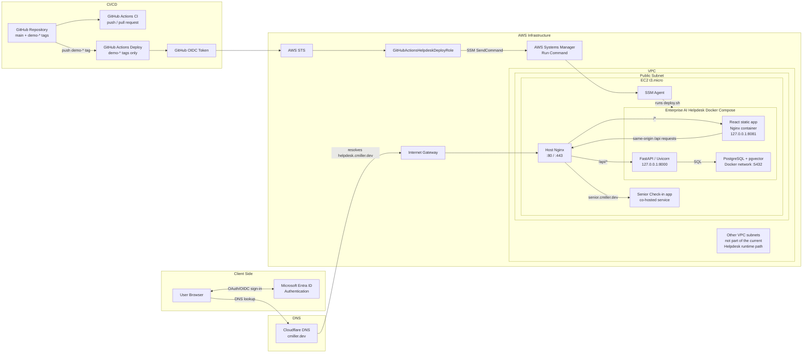
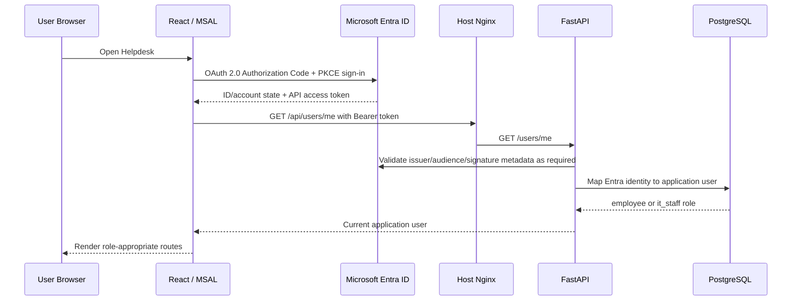
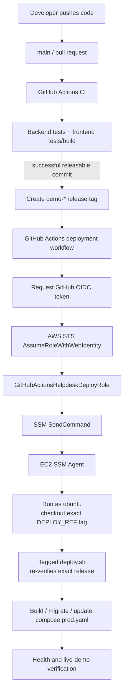

# Enterprise AI Helpdesk Architecture

## System Overview

Enterprise AI Helpdesk is a full-stack IT support portfolio application designed to model an enterprise helpdesk workflow and provide a foundation for later AI-assisted support capabilities.

Phase 1 provides the production-ready transactional workflow:

- Employees authenticate and create support tickets.
- Employees can view their own tickets, ticket status, and notes.
- IT staff can view assigned and unassigned queues.
- IT staff can claim tickets, add work notes, and resolve tickets.
- Microsoft Entra ID provides OAuth 2.0 / OpenID Connect authentication.
- FastAPI performs backend token validation and maps authenticated identities to application users and roles.
- Backend authorization enforces employee and IT-staff permissions independently of frontend routing.

Later phases are expected to add AI-assisted knowledge retrieval, RAG/hybrid search, pgvector-backed semantic retrieval, tool-using agents, evaluation, and observability. Those roadmap capabilities should not be described as live production features until they are implemented and deployed.

### Core technology stack

| Layer | Technology |
| --- | --- |
| Frontend | React, TypeScript, Vite, React Router, MSAL |
| Backend | Python, FastAPI, Pydantic |
| Persistence | PostgreSQL, pgvector, SQLAlchemy, Alembic |
| Authentication | Microsoft Entra ID, OAuth 2.0 / OIDC |
| Containers | Docker, Docker Compose |
| Edge/reverse proxy | Nginx |
| Cloud compute | AWS EC2 |
| Remote operations | AWS Systems Manager / SSM Agent |
| CI/CD identity | GitHub Actions + GitHub OIDC + AWS STS |
| DNS | Cloudflare DNS |
| TLS | Let's Encrypt / Certbot |

## Architecture Overview



## Request Flow

### Browser application flow

1. The browser resolves `helpdesk.cmiller.dev` through Cloudflare DNS.
2. Traffic reaches the EC2 instance through the VPC's internet-facing network path.
3. Host Nginx terminates HTTPS and selects the Helpdesk virtual host by `server_name`.
4. Requests under `/` are proxied to the React/Nginx container on loopback port `8081`.
5. Requests under `/api/` are proxied to the FastAPI container on loopback port `8000`.
6. Host Nginx strips the external `/api` prefix so existing FastAPI routes remain `/tickets`, `/users/me`, `/health`, and so on.
7. FastAPI accesses PostgreSQL over the private Docker Compose network.

Production frontend configuration therefore uses:

```env
VITE_API_BASE_URL=/api
```

This same-origin design avoids exposing a separate API hostname and avoids cross-origin browser traffic in production.

## Authentication and Authorization Flow



Frontend role-aware routing improves user experience, but backend authorization remains the security boundary. A user cannot gain IT permissions merely by navigating to an IT route in the browser.

## Compute Services

### AWS EC2

The current production host is a single AWS EC2 `t3.micro` instance used for portfolio/demo workloads.

Current host characteristics:

```text
vCPU: 2 burstable vCPUs
RAM: 1 GiB
Swap: 2 GiB
```

A low swappiness value is configured so swap acts mainly as protection against short memory spikes rather than normal working memory.

The instance currently hosts both:

- Senior Check-in.
- Enterprise AI Helpdesk.

Host Nginx allows the applications to share ports 80/443 while remaining separated by hostname and internal application ports.

The Helpdesk production containers are expected to be:

```text
frontend -> 127.0.0.1:8081
backend  -> 127.0.0.1:8000
db       -> Docker network only :5432
```

This single-instance architecture is intentionally cost-conscious and appropriate for a low-traffic portfolio demonstration. It is not intended to model a highly available production cluster.

### Capacity considerations

Primary memory consumers include:

- Ubuntu and system services.
- Docker Engine.
- PostgreSQL/pgvector.
- FastAPI/Python.
- Senior Check-in.
- Docker image builds during deployment.

The React runtime itself is lightweight because production assets are static files served by Nginx. Build-time Node/Vite work may create larger temporary memory spikes than normal frontend serving.

If routine operation begins using swap heavily or containers become unstable, the preferred solution is a larger-memory EC2 instance rather than increasing swap indefinitely.

## Networking

### VPC

The EC2 instance runs inside an AWS Virtual Private Cloud (VPC).

The Helpdesk runtime requires the following internet-facing path:

```text
Internet
   |
Internet Gateway
   |
VPC route table
   |
Public subnet
   |
EC2 private network interface + public IPv4 mapping
```

An Internet Gateway does not by itself make every subnet or instance public. For the EC2 instance to be internet reachable, the relevant subnet must have a route to the Internet Gateway and the instance must have an appropriate public IPv4 address or equivalent public endpoint, while security-group rules must permit the traffic.

### Other subnets

Other subnets may exist in the VPC, including subnets described in the AWS console or account design as private. They are not part of the current Helpdesk request path unless a Helpdesk resource is actually deployed into them.

A subnet should be classified from its effective route table rather than from its name alone. In particular, a private subnet normally lacks a direct default route to an Internet Gateway.

For this architecture, document only the subnet containing the EC2 instance as an active Helpdesk runtime dependency unless later infrastructure moves PostgreSQL or other services into separate subnets.

### Public/private port boundary

Desired public exposure:

```text
80/tcp   HTTP, primarily redirect/ACME handling
443/tcp  HTTPS application traffic
```

Internal-only application ports:

```text
8000/tcp FastAPI, host loopback only
8081/tcp React/Nginx container, host loopback only
5432/tcp PostgreSQL, Docker network only
```

SSH port 22 is not required for application traffic. If retained for administration, it should be restricted rather than broadly internet accessible. AWS Systems Manager provides the deployment automation path without requiring GitHub Actions to SSH into EC2.

## DNS and Edge Routing

Cloudflare manages DNS records for `cmiller.dev`.

Relevant application hostnames are:

```text
cmiller.dev
senior.cmiller.dev
helpdesk.cmiller.dev
```

`www.helpdesk.cmiller.dev` and `www.senior.cmiller.dev` are intentionally not part of the application architecture.

Host Nginx uses separate virtual-host routing so one EC2 public endpoint can host multiple portfolio applications.

The Helpdesk virtual host routes:

```text
/*      -> React/Nginx container
/api/*  -> FastAPI container
```

TLS certificates are managed on the host by Certbot using Let's Encrypt.

## Data Storage

### PostgreSQL/pgvector

Enterprise AI Helpdesk uses one PostgreSQL database with the pgvector extension available for current/future vector-search capabilities.

In production:

- PostgreSQL runs in its own Docker container.
- FastAPI connects to the database over the Docker Compose network.
- Port `5432` is not published to the internet or host network.
- A named Docker volume persists database files across container recreation.
- Alembic manages schema migrations.

The volume is persistent across ordinary Docker Compose updates, but it is still stored on the EC2 instance's underlying storage. This portfolio architecture does not currently provide the durability, automated backups, failover, or managed operations of Amazon RDS.

The deployed database is treated as disposable demo data: no production customer data or sensitive personal information should be stored in it.

### Future AI data

Later phases may store document chunks, embeddings, retrieval metadata, or evaluation data in PostgreSQL/pgvector. For the expected portfolio-scale corpus, this remains compatible with the single-database design. Capacity should be reassessed if ingestion volume or index size becomes materially larger.

## Security and Access

### Microsoft Entra ID

Microsoft Entra ID authenticates users through OAuth 2.0 / OpenID Connect.

The production SPA redirect origin is:

```text
https://helpdesk.cmiller.dev
```

Dedicated public demo identities are mapped to application users in PostgreSQL. These identities are intentionally isolated and hold no tenant administrative privileges.

### Application authorization

FastAPI validates access tokens and resolves the authenticated identity to the application's `employee` or `it_staff` role.

Role enforcement occurs on the backend. Frontend route protection is an additional UX control, not the sole authorization mechanism.

### AWS IAM roles

Two IAM trust boundaries are relevant:

#### GitHub deployment role

```text
GitHubActionsHelpdeskDeployRole
```

This role:

- Trusts GitHub's OIDC provider rather than long-lived AWS access keys.
- Is scoped to the immutable owner/repository identity of `enterprise-ai-helpdesk`.
- Can be assumed only from Git refs matching `refs/tags/demo-*`.
- Receives only the SSM deployment permissions required by the workflow.

The trust policy determines who may assume the role. A separate IAM permissions policy determines what the role may do after assumption.

#### EC2 instance profile

The EC2 instance uses its own IAM instance role/profile so the SSM Agent can register and communicate with AWS Systems Manager.

The instance role is independent of the GitHub deployment role.

### EC2 security group

The desired security-group posture is:

- Permit public HTTP/HTTPS required by Nginx.
- Do not expose ports `8000`, `8081`, or `5432` publicly.
- Restrict or eliminate public SSH according to administrative needs.
- Use least privilege for any additional inbound rules.

The exact live security-group rules should be verified in AWS before documenting them as current state.

### Repository and deployment secrets

The repository contains deployment structure but never live secrets.

Sensitive values remain on EC2 or in an appropriate secret store and include:

- Database passwords.
- `DATABASE_URL` when it contains credentials.
- `OPENAI_API_KEY` in later phases.
- SSH private deploy keys.
- Any future Entra client secret, if a confidential server-side integration ever requires one.

GitHub deployment variables such as region, instance identifier, application directory, and role ARN are configuration values rather than static AWS credentials.

## Deployment Pipeline



### CI policy

Normal development runs tests and build validation only. It does not deploy production.

### Release policy

Production releases use tags matching:

```text
demo-*
```

The restriction exists in both:

1. GitHub Actions trigger/logic.
2. AWS OIDC trust policy.

The AWS restriction prevents a branch workflow such as `main` from assuming the deployment role even if workflow configuration is accidentally changed later.

### Deployment identity

GitHub Actions does not store `AWS_ACCESS_KEY_ID` or `AWS_SECRET_ACCESS_KEY` for deployment.

The workflow requests a short-lived GitHub OIDC token, AWS STS validates the trusted subject, and AWS returns temporary role credentials for the deployment job.

### Remote execution

GitHub Actions does not SSH into the instance for deployment. It calls AWS Systems Manager Run Command. The EC2 SSM Agent runs a small bootstrap under the `ubuntu` user that fetches and checks out the exact release tag before invoking that tag's `deploy.sh`. The script then repeats the tag and commit verification as defense in depth.

While the GitHub repository remains private, `deploy.sh`/Git on EC2 uses a repository-specific read-only SSH Deploy Key to fetch the selected release tag.

## Monitoring and Logs

### Current baseline

The portfolio deployment uses a lightweight monitoring approach appropriate to a single low-traffic EC2 instance.

Available operational signals include:

- Standard EC2 CloudWatch instance metrics such as CPU utilization, network traffic, and instance status checks.
- `free -h`, `swapon --show`, `df -h`, and `docker stats` for host resource inspection.
- Host Nginx access/error logs.
- Docker container logs for frontend, backend, and database services.
- Systemd/journal logs for Nginx and host services.
- GitHub Actions workflow logs.
- AWS SSM Run Command status and command output retrieved by the deployment workflow.

### Not currently assumed

The architecture does not assume that application logs are already centralized in CloudWatch Logs. CloudWatch log shipping, custom metrics, alarms, dashboards, and distributed tracing should be documented only after they are explicitly configured.

### Future improvements

Potential later operational improvements include:

- CloudWatch Agent for host/application log forwarding.
- CloudWatch alarms for CPU, disk pressure, instance status, or other useful thresholds.
- Container health checks surfaced during deployment.
- Application-level structured logging.
- AI/RAG evaluation and observability metrics in later phases.

## Availability, Recovery, and Limitations

The current architecture is intentionally optimized for portfolio value and low cost rather than high availability.

Known tradeoffs:

- One EC2 instance is a single point of failure.
- PostgreSQL is hosted on the same instance rather than a managed HA database.
- Deployments rebuild services on the same host.
- Swap reduces the likelihood of short-memory-spike failures but does not replace physical RAM.
- No load balancer or autoscaling group is currently required for expected demo traffic.

Release tags provide deterministic application rollback. Database rollback remains a separate concern if a future schema migration is not backward compatible.

## Architecture Decision Summary

| Decision | Rationale |
| --- | --- |
| Same EC2 host as Senior Check-in | Zero/low additional infrastructure cost and sufficient capacity for portfolio traffic. |
| Host Nginx as shared edge | One public 80/443 endpoint can route multiple applications by hostname. |
| React and FastAPI containerized separately | Clear service boundaries and reproducible production runtime. |
| PostgreSQL in Docker Compose | Appropriate for a demo environment and supports pgvector roadmap work. |
| PostgreSQL not host-published | Reduces attack surface; only backend needs database access. |
| Same-origin `/api` routing | Simplifies frontend configuration and avoids production CORS complexity. |
| Entra OAuth/OIDC | Demonstrates modern enterprise authentication and token-based API security. |
| Backend RBAC | Authorization remains enforced at the API security boundary. |
| GitHub OIDC instead of AWS keys | Uses short-lived AWS credentials and removes long-lived deployment keys from GitHub. |
| AWS SSM instead of GitHub SSH | Keeps inbound deployment access off the GitHub runner path and reuses managed AWS operations. |
| `demo-*` production tags | Keeps live demo stable while `main` advances through later project phases. |
| Exact-tag deployment | Makes live version reproducible and supports deterministic rollback. |
| 2 GiB swap on t3.micro | Adds a safety margin for occasional memory spikes without immediate instance cost increase. |

## Documentation Boundaries

This file is intended to remain safe in a public repository.

Do not add:

- Passwords.
- API keys.
- Private keys.
- Tokens.
- Real `.env` contents.
- Database connection strings containing credentials.
- Unnecessary AWS account or instance identifiers.

Operational commands and non-secret architecture conventions belong in `docs/DEPLOYMENT.md`. Detailed implementation instructions for AI coding agents should remain concise in `AGENTS.md` and point to these architecture documents rather than duplicating them.
