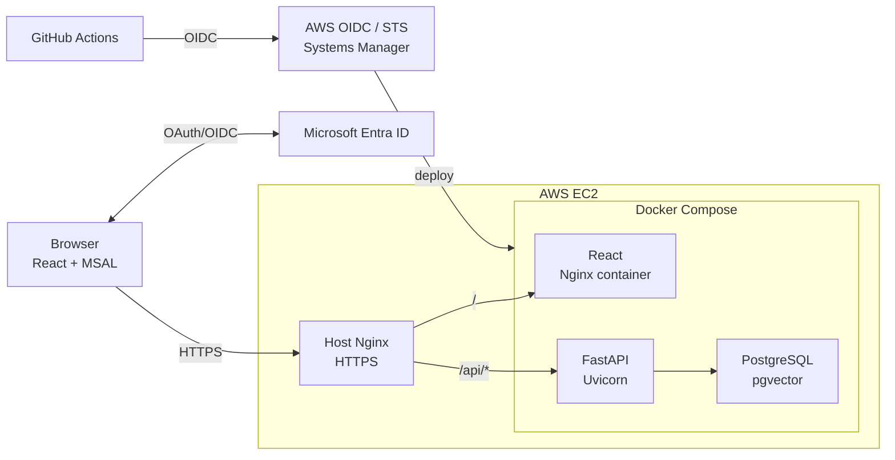
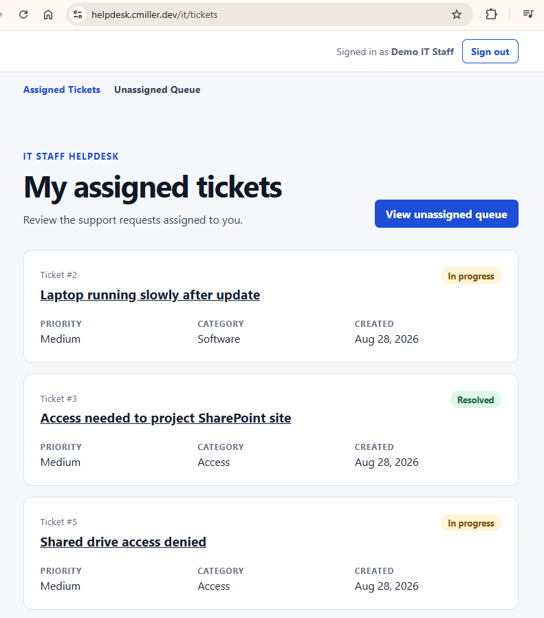
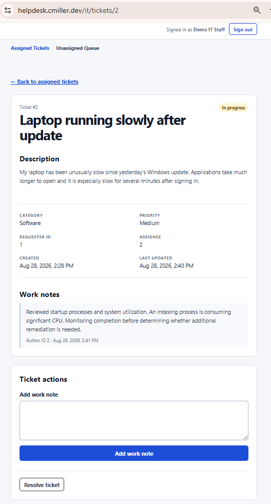
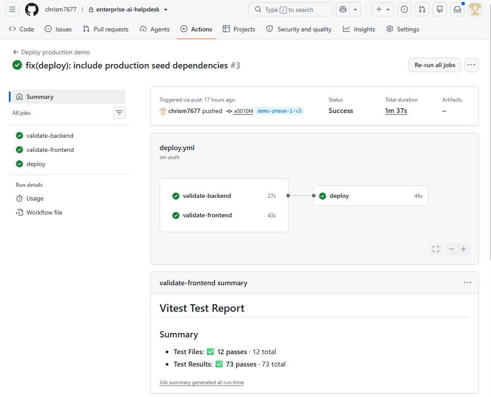

# Full-Stack Portfolio Project: Enterprise AI Helpdesk

A production-deployed full-stack IT support platform built with React, FastAPI, PostgreSQL, Microsoft Entra ID, Docker, AWS, and GitHub Actions.

Phase 1 implements a complete authenticated helpdesk workflow for employees and IT staff. The project is designed as the foundation for later phases adding AI-assisted knowledge retrieval, RAG, and MCP-based tool-using agents, followed by evaluation and observability.

## Live Demo

**https://helpdesk.cmiller.dev**

Demo employee and IT staff accounts are displayed on the signed-out home page.

The live environment contains only synthetic demo data.

## Highlights

- Microsoft Entra ID authentication using OAuth 2.0 / OpenID Connect
- MSAL in React with backend JWT validation of issuer, audience, signature, tenant, and delegated scope
- Server-side role-based authorization for employee and IT staff workflows
- React + TypeScript frontend with protected role-aware routing
- FastAPI REST API with Pydantic validation and dependency injection
- PostgreSQL persistence with SQLAlchemy and Alembic migrations
- Production Docker Compose environment for frontend, backend, and PostgreSQL
- Nginx reverse proxy with HTTPS through Let's Encrypt / Certbot
- GitHub Actions CI for backend and frontend validation
- AWS deployment using GitHub OIDC, short-lived AWS credentials, Systems Manager,
  and immutable `demo-*` release tags

## Phase 1 Features

- Both roles sign in with Microsoft Entra ID

### Employee workflow

- Submit support tickets
- View their own tickets
- View ticket status and work notes
- Access only employee-authorized application routes and API operations

### IT staff workflow

- View unassigned and assigned ticket queues
- Claim tickets
- Add work notes
- Resolve tickets
- Access only IT-authorized application routes and API operations

Authorization is enforced by the FastAPI backend in addition to frontend route protection.

## Technology Stack

| Layer | Technology |
| --- | --- |
| Frontend | React, TypeScript, Vite, React Router, MSAL |
| Backend | Python, FastAPI, Pydantic |
| ORM / migrations | SQLAlchemy 2.x, Alembic |
| Database | PostgreSQL, pgvector |
| Authentication | Microsoft Entra ID, OAuth 2.0 / OIDC |
| Containers | Docker, Docker Compose |
| Reverse proxy | Nginx |
| Cloud | AWS EC2 |
| Deployment | GitHub Actions, GitHub OIDC, AWS STS, AWS Systems Manager |
| DNS | Cloudflare |
| TLS | Let's Encrypt / Certbot |
| Testing | Pytest, frontend unit/integration tests |

## Architecture

## Repository Guide

- backend/ — FastAPI application, SQLAlchemy models, services, authentication, Alembic migrations, and tests
- frontend/ — React/TypeScript application, MSAL integration, protected routing, and frontend tests
- ARCHITECTURE.md — detailed architecture, authentication, networking, deployment, and request flows
- docs/DEPLOYMENT.md — detailed production deployment and operational runbook
- AGENTS.md — development conventions and guidanceused for AI-assisted coding and repository changes

## IT Landing Page

## Ticket Screen

## CI/CD Pipeline

